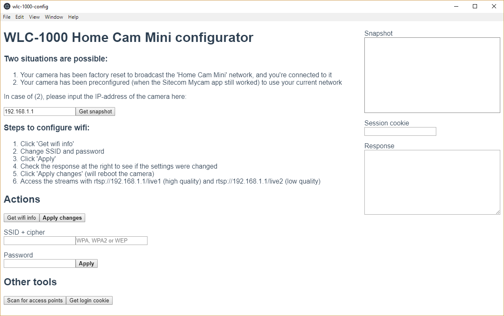

# wlc-1000-config

Electron-based tool to update wifi settings in a Sitecom WLC-1000 Home Cam Mini.

## Project setup
```
npm install
```

### Compiles and hot-reloads for development
```
npm run electron:serve
```

### Compiles and minifies for production
```
npm run electron:build
```
### Screenshot

